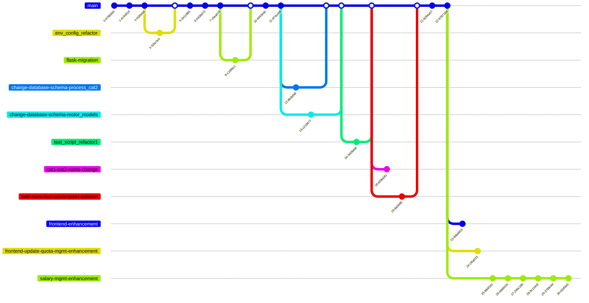

# Git Branch Diagram

## Branch Summary

### Local Branches

| Branch | Description | Status |
|--------|-------------|--------|
| `master` | Main branch | Active |
| `salary-mgmt-enhancement` | Salary management enhancement features | Currently checked out |
| `frontend-update-quota-mgmt-enhancement` | Quota management page redesign | |
| `frontend-enhancement` | Frontend enhancements | |
| `add-more-test-cases-cover-deletion` | Deletion test cases | |
| `change-database-schema-motor_models` | Motor models schema refactor | |
| `change-database-schema-process_cat2` | Process cat2 schema change | |
| `env_config_refactor` | Environment config refactor | |
| `flask-migration` | Flask migration (abandoned) | |
| `test_script_refactor1` | Test script refactor | |
| `cat1-cat2-name-change` | Category name changes | |

### Remote Branches

| Remote Branch | Tracking |
|---------------|----------|
| `origin/master` | Local `master` |
| `origin/cat1-cat2-name-change` | Local `cat1-cat2-name-change` |
| `origin/flask-migration` | Local `flask-migration` |

## Recent Activity

The most recent commits on `salary-mgmt-enhancement` branch:
- `cbfa39b` - feat: 工序搜索增强功能
- `ce7f401` - fix: 工序搜索下拉框显示问题
- `be99b53` - feat: 显示完整定额信息
- `bcd062b` - feat: 工资记录管理页面添加工作记录功能
- `7547606` - 重构工资记录管理页面
