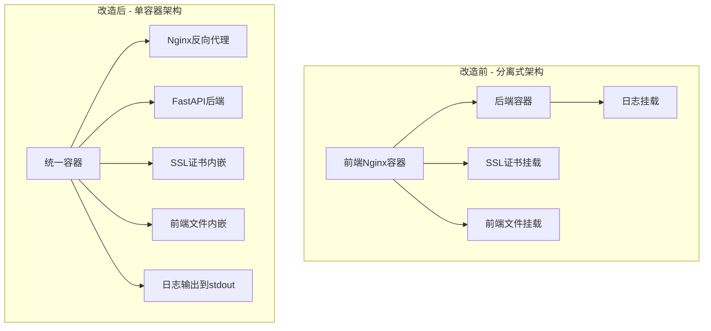
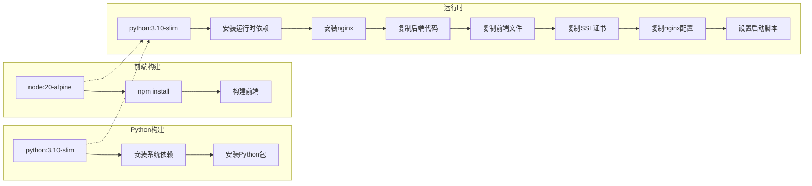
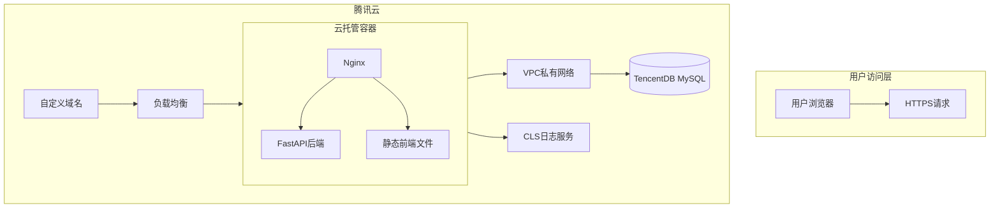
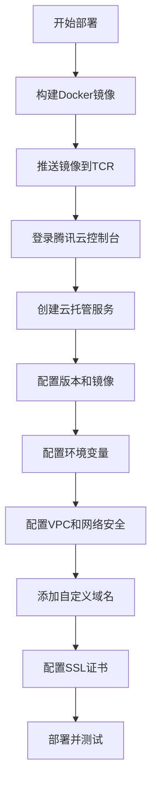

# 云托管 (CloudBase Run) 部署计划

## 概述

本计划将当前应用改造为适合部署到腾讯云云托管 (CloudBase Run) 的形式。

## 核心改造内容

### 1. Docker镜像重构



### 2. 文件变更清单

| 文件 | 当前状态 | 目标状态 | 行动 |
|-----|---------|---------|------|
| `Dockerfile` | 只包含Python后端 | 包含Nginx+后端+前端+SSL | 重写 |
| `docker-compose.yml` | 2个容器+volume挂载 | 1个容器+无挂载 | 简化 |
| `nginx.conf` | 独立挂载 | 内嵌到镜像 | 复制到镜像 |
| `ssl/` | 独立挂载 | 内嵌到镜像 | 复制到镜像 |
| `frontend/dist` | 独立挂载 | 内嵌到镜像 | 已在镜像中 |
| `logs/` | 独立挂载 | 输出到stdout | 修改应用日志 |

### 3. 新的Dockerfile架构



### 4. 日志解决方案

对于云托管环境，推荐使用**stdout/stderr输出 + 腾讯云CLS自动收集**：

```mermaid
flowchart TB
    subgraph 应用层
        A[Python应用] --> B[logging模块]
        B --> C[输出到stdout]
    end
    
    subgraph 容器层
        C --> D[容器日志]
    end
    
    subgraph 云平台层
        D --> E[腾讯云CLS]
        E --> F[日志检索]
        E --> G[日志分析]
        E --> H[告警设置]
    end
    
    特点:
    - 无需挂载volume
    - 腾讯云自动收集
    - 支持实时检索
    - 支持日志分析
```

### 5. 部署架构



## 实施步骤

### 阶段1: Dockerfile重构

1. **修改Dockerfile**
   - 添加nginx安装
   - 复制nginx配置文件到 `/etc/nginx/conf.d/`
   - 复制SSL证书到 `/app/ssl/`
   - 创建启动脚本，同时启动nginx和后端

2. **修改应用日志配置**
   - 将日志输出到stdout/stderr
   - 使用JSON格式便于日志分析

### 阶段2: docker-compose.yml简化

1. 移除nginx服务
2. 移除所有volume挂载
3. 保留环境变量配置

### 阶段3: 部署文档编写

1. **创建部署文档** (`CLOUD_RUN_DEPLOYMENT.md`)
   - 环境准备
   - 构建步骤
   - 推送镜像
   - 云托管配置
   - 域名和SSL配置
   - 日志配置

## 文件修改详情

### Dockerfile修改

```dockerfile
# ============================================================
# 统一容器架构 - 包含 Nginx + FastAPI + 前端 + SSL
# ============================================================

# Stage 1: Python Builder
FROM python:3.10-slim AS builder
# ... (保持不变)

# Stage 2: Frontend Builder  
FROM docker.m.daocloud.io/node:20-alpine AS frontend-builder
# ... (保持不变)

# Stage 3: Runtime - 统一运行时
FROM python:3.10-slim AS runtime

# 安装运行时依赖 + nginx
RUN apt-get update -y && apt-get install -y --no-install-recommends \
    default-libmysqlclient-dev \
    libglib2.0-0 \
    libsm6 \
    libxext6 \
    libxrender1 \
    nginx \
    && rm -rf /var/lib/apt/lists/*

# 复制Python依赖
COPY --from=builder /usr/local/lib/python3.10/site-packages /usr/local/lib/python3.10/site-packages
COPY --from=builder /build/requirements.txt /app/requirements.txt

# 复制后端代码
COPY backend/ /app/backend/

# 复制前端文件
COPY --from=frontend-builder /app/frontend/dist /app/frontend/dist/

# 复制SSL证书
COPY ssl/ /app/ssl/

# 复制Nginx配置
COPY nginx-https-production.conf /etc/nginx/conf.d/default.conf

# 创建日志目录
RUN mkdir -p /app/logs

# 设置环境变量
ENV PYTHONPATH=/app \
    PYTHONUNBUFFERED=1

# 暴露端口 (nginx:443, backend:8000)
EXPOSE 443 8000

# 健康检查
HEALTHCHECK --interval=30s --timeout=3s --start-period=5s --retries=3 \
    CMD python -c "import urllib.request; urllib.request.urlopen('http://localhost:8000/api/health', timeout=2)" || exit 1

# 启动脚本 - 同时启动nginx和后端
COPY docker-entrypoint.sh /docker-entrypoint.sh
RUN chmod +x /docker-entrypoint.sh
ENTRYPOINT ["/docker-entrypoint.sh"]
```

### docker-entrypoint.sh

```bash
#!/bin/bash
set -e

# 启动nginx (前台运行)
nginx

# 启动后端
exec python backend/run.py
```

### docker-compose.yml修改

```yaml
services:
  payroll:
    container_name: payroll
    build:
      context: .
      dockerfile: Dockerfile
    ports:
      - "443:443"
    env_file:
      - ~/shared/jianglei/payroll/env_local.sh
    environment:
      - PYTHONPATH=/app
      - PYTHONUNBUFFERED=1
    # 移除所有volume挂载
    restart: unless-stopped
```

## 部署流程



## 费用预估

| 项目 | 费用 |
|-----|------|
| 云托管计算 | 按量计费，约 0.05-0.1元/小时 |
| TCR存储 | 约 0.1元/GB/月 |
| CLS日志 | 约 0.1元/GB/月 |
| 域名 | 约 50-100元/年 |
| SSL证书 | 免费 (腾讯云DV证书) |
| TencentDB | 约 100-500元/月 (根据配置) |

## 时间规划

| 阶段 | 任务 | 预计时间 |
|-----|------|---------|
| 阶段1 | Docker镜像重构 | 2-3小时 |
| 阶段2 | docker-compose简化 | 30分钟 |
| 阶段3 | 日志配置调整 | 1小时 |
| 阶段4 | 部署文档编写 | 2-3小时 |
| 阶段5 | 测试验证 | 1-2小时 |

## 风险和注意事项

1. **SSL证书管理**: 确保SSL证书在镜像中，且域名与证书匹配
2. **端口配置**: 云托管需要暴露443端口，并在安全组中开放
3. **VPC配置**: 确保云托管能访问数据库
4. **日志格式**: 使用JSON格式便于日志分析
5. **健康检查**: 正确配置健康检查端点

## 验证清单

- [ ] Docker镜像构建成功
- [ ] 镜像大小在合理范围内
- [ ] 本地测试通过
- [ ] 镜像推送到TCR
- [ ] 云托管服务创建成功
- [ ] 环境变量配置正确
- [ ] 数据库连接正常
- [ ] HTTPS访问正常
- [ ] 日志收集正常
- [ ] 负载均衡和自动伸缩配置正确
