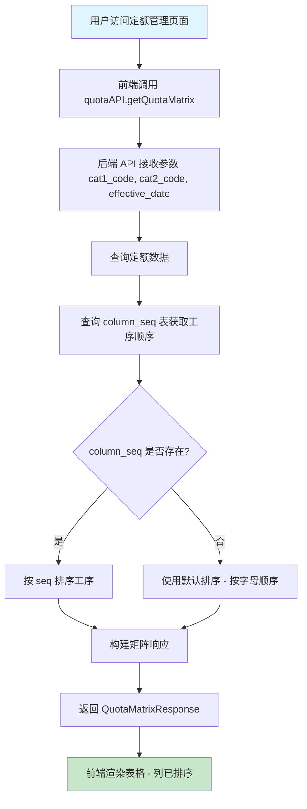

# Column Sequence Implementation Plan

## Overview

This document describes the implementation plan for adding the `column_seq` table to the database model and integrating it with the quota management page. The `column_seq` table will define the column sequence of the quota table display.

## Current Architecture

### Existing Database Schema
The current database has the following tables:
- `users` - User management
- `workers` - Worker information
- `processes` - Process information
- `process_cat1` - Process category 1 (工段类别)
- `process_cat2` - Process category 2 (工序类别)
- `motor_models` - Motor model information
- `quotas` - Quota/pricing table
- `work_records` - Work records
- `v_salary_records` - Salary records view

### Current Quota Matrix Display
The current `QuotaManagement.jsx` page displays a matrix with:
- Rows: Motor models (sorted by numeric prefix)
- Columns: Processes (alphabetically sorted)
- Cells: Unit prices

## Implementation Plan

### 1. Database Layer Changes

#### 1.1 New Table: `column_seq`

```sql
CREATE TABLE column_seq (
    id INTEGER PRIMARY KEY AUTOINCREMENT,
    cat1_code VARCHAR(4) NOT NULL,
    cat2_code VARCHAR(30) NOT NULL,
    process_code VARCHAR(20) NOT NULL,
    seq INTEGER NOT NULL,
    created_at DATETIME DEFAULT CURRENT_TIMESTAMP,
    -- Unique constraint for the combination
    UNIQUE(cat1_code, cat2_code, process_code)
);
```

**Fields:**
| Field | Type | Description |
|-------|------|-------------|
| id | INTEGER | Primary key |
| cat1_code | VARCHAR(4) | Process category 1 code (工段类别) |
| cat2_code | VARCHAR(30) | Process category 2 code (工序类别) |
| process_code | VARCHAR(20) | Process code |
| seq | INTEGER | Sequence number for column ordering |
| created_at | DATETIME | Creation timestamp |

#### 1.2 SQLAlchemy Model (`backend/app/models.py`)

```python
class ColumnSeq(Base):
    """定额表列顺序表"""
    __tablename__ = "column_seq"
    
    id = Column(Integer, primary_key=True, index=True)
    cat1_code = Column(String(4), nullable=False, index=True)
    cat2_code = Column(String(30), nullable=False, index=True)
    process_code = Column(String(20), nullable=False, index=True)
    seq = Column(Integer, nullable=False, comment="列顺序号")
    created_at = Column(DateTime(timezone=True), server_default=func.now())
    
    # 唯一约束
    __table_args__ = (
        UniqueConstraint('cat1_code', 'cat2_code', 'process_code', name='_cat1_cat2_process_uc'),
    )
```

### 2. Schema Layer Changes

#### 2.1 Pydantic Schemas (`backend/app/schemas.py`)

```python
# 列顺序相关模型
class ColumnSeqBase(BaseModel):
    """列顺序基础模型"""
    cat1_code: str = Field(..., min_length=1, max_length=4)
    cat2_code: str = Field(..., min_length=1, max_length=30)
    process_code: str = Field(..., min_length=1, max_length=20)
    seq: int = Field(..., ge=0, description="列顺序号")

class ColumnSeqCreate(ColumnSeqBase):
    """创建列顺序模型"""
    pass

class ColumnSeqUpdate(BaseModel):
    """更新列顺序模型"""
    seq: Optional[int] = Field(None, ge=0)

class ColumnSeqInDB(ColumnSeqBase):
    """数据库中的列顺序模型"""
    id: int
    created_at: datetime

    class Config:
        from_attributes = True

class ColumnSeq(ColumnSeqInDB):
    """返回给客户端的列顺序模型"""
    pass

# 更新 QuotaMatrixColumn 以包含 seq
class QuotaMatrixColumn(BaseModel):
    """定额矩阵列模型"""
    process_code: str
    process_name: str
    seq: Optional[int] = None  # 新增：列顺序号
```

### 3. CRUD Layer Changes

#### 3.1 CRUD Operations (`backend/app/crud.py`)

```python
# 列顺序相关CRUD

def get_column_seq_by_id(db: Session, id: int) -> Optional[models.ColumnSeq]:
    """根据ID获取列顺序"""
    return db.query(models.ColumnSeq).filter(models.ColumnSeq.id == id).first()

def get_column_seq_by_combination(db: Session, cat1_code: str, cat2_code: str) -> List[models.ColumnSeq]:
    """根据工段类别和工序类别获取列顺序列表"""
    return db.query(models.ColumnSeq).filter(
        models.ColumnSeq.cat1_code == cat1_code,
        models.ColumnSeq.cat2_code == cat2_code
    ).order_by(models.ColumnSeq.seq).all()

def get_column_seq_list(db: Session, skip: int = 0, limit: int = 100) -> List[models.ColumnSeq]:
    """获取列顺序列表"""
    return db.query(models.ColumnSeq).offset(skip).limit(limit).all()

def create_column_seq(db: Session, column_seq: schemas.ColumnSeqCreate) -> models.ColumnSeq:
    """创建列顺序"""
    db_column_seq = models.ColumnSeq(**column_seq.model_dump())
    db.add(db_column_seq)
    db.commit()
    db.refresh(db_column_seq)
    return db_column_seq

def update_column_seq(db: Session, id: int, column_seq_update: schemas.ColumnSeqUpdate) -> Optional[models.ColumnSeq]:
    """更新列顺序"""
    db_column_seq = get_column_seq_by_id(db, id)
    if not db_column_seq:
        return None
    
    update_data = column_seq_update.model_dump(exclude_unset=True)
    for field, value in update_data.items():
        setattr(db_column_seq, field, value)
    
    db.commit()
    db.refresh(db_column_seq)
    return db_column_seq

def delete_column_seq(db: Session, id: int) -> Optional[dict]:
    """删除列顺序"""
    db_column_seq = get_column_seq_by_id(db, id)
    if not db_column_seq:
        return None
    
    column_seq_info = {
        "id": db_column_seq.id,
        "cat1_code": db_column_seq.cat1_code,
        "cat2_code": db_column_seq.cat2_code,
        "process_code": db_column_seq.process_code
    }
    
    db.delete(db_column_seq)
    db.commit()
    return column_seq_info

def get_process_sequence_map(db: Session, cat1_code: str, cat2_code: str) -> dict:
    """
    获取工序顺序映射
    
    返回: {process_code: seq}
    如果没有配置顺序，返回空字典
    """
    column_seqs = get_column_seq_by_combination(db, cat1_code, cat2_code)
    return {cs.process_code: cs.seq for cs in column_seqs}
```

### 4. API Layer Changes

#### 4.1 New API Router (`backend/app/api/column_seq.py`)

```python
from fastapi import APIRouter, Depends, HTTPException
from sqlalchemy.orm import Session
from typing import List

from .. import crud, schemas, models
from ..database import get_db
from ..dependencies import get_current_active_user

router = APIRouter(
    prefix="/column-seq",
    tags=["column-seq"],
    responses={404: {"description": "Not found"}},
)

@router.get("/", response_model=List[schemas.ColumnSeq])
def read_column_seqs(
    cat1_code: str = None,
    cat2_code: str = None,
    skip: int = 0,
    limit: int = 100,
    db: Session = Depends(get_db),
    current_user: schemas.User = Depends(get_current_active_user)
):
    """获取列顺序列表，可按工段类别和工序类别过滤"""
    if cat1_code and cat2_code:
        return crud.get_column_seq_by_combination(db, cat1_code, cat2_code)
    return crud.get_column_seq_list(db, skip=skip, limit=limit)

@router.get("/{id}", response_model=schemas.ColumnSeq)
def read_column_seq(
    id: int,
    db: Session = Depends(get_db),
    current_user: schemas.User = Depends(get_current_active_user)
):
    """根据ID获取列顺序"""
    column_seq = crud.get_column_seq_by_id(db, id=id)
    if not column_seq:
        raise HTTPException(status_code=404, detail="Column sequence not found")
    return column_seq

@router.post("/", response_model=schemas.ColumnSeq, status_code=201)
def create_column_seq(
    column_seq: schemas.ColumnSeqCreate,
    db: Session = Depends(get_db),
    current_user: schemas.User = Depends(get_current_active_user)
):
    """创建列顺序"""
    return crud.create_column_seq(db=db, column_seq=column_seq)

@router.put("/{id}", response_model=schemas.ColumnSeq)
def update_column_seq(
    id: int,
    column_seq_update: schemas.ColumnSeqUpdate,
    db: Session = Depends(get_db),
    current_user: schemas.User = Depends(get_current_active_user)
):
    """更新列顺序"""
    column_seq = crud.update_column_seq(db, id=id, column_seq_update=column_seq_update)
    if not column_seq:
        raise HTTPException(status_code=404, detail="Column sequence not found")
    return column_seq

@router.delete("/{id}")
def delete_column_seq(
    id: int,
    db: Session = Depends(get_db),
    current_user: schemas.User = Depends(get_current_active_user)
):
    """删除列顺序"""
    column_seq = crud.delete_column_seq(db, id=id)
    if not column_seq:
        raise HTTPException(status_code=404, detail="Column sequence not found")
    return {"message": "列顺序删除成功", "id": id}
```

#### 4.2 Update Main Router (`backend/app/main.py`)

Add the new router:
```python
from app.api import column_seq

app.include_router(column_seq.router)
```

#### 4.3 Update Quota Matrix API (`backend/app/api/quota.py`)

Update the `get_quota_matrix_data` function in `crud.py` to use column sequence:

```python
def get_quota_matrix_data(db: Session, cat1_code: str, cat2_code: str, effective_date: str) -> Optional[dict]:
    # ... existing code ...
    
    # 获取列顺序映射
    seq_map = get_process_sequence_map(db, cat1_code, cat2_code)
    
    # 排序工序
    def get_process_sort_key(process_code):
        if seq_map and process_code in seq_map:
            return seq_map[process_code]
        # 如果没有配置顺序，使用较大的数字排在后面
        return float('inf')
    
    sorted_processes = sorted(process_codes, key=get_process_sort_key)
    
    # ... rest of the code ...
```

### 5. Frontend Changes

#### 5.1 Type Definitions (`frontend/src/types/index.ts`)

```typescript
/**
 * 列顺序类型定义
 */
export interface ColumnSeq {
  id: number;
  cat1_code: string;
  cat2_code: string;
  process_code: string;
  seq: number;
  created_at?: string;
}

/**
 * 定额矩阵列类型定义（更新）
 */
export interface QuotaMatrixColumn {
  process_code: string;
  process_name: string;
  seq?: number;  // 新增：列顺序号
}
```

#### 5.2 API Service (`frontend/src/services/api.ts`)

```typescript
// 列顺序管理API
export const columnSeqAPI = {
  getColumnSeqList: (params?: { cat1_code?: string; cat2_code?: string }): Promise<ColumnSeq[]> => 
    api.get('/column-seq/', { params }),
  getColumnSeq: (id: number): Promise<ColumnSeq> => 
    api.get(`/column-seq/${id}`),
  createColumnSeq: (data: Omit<ColumnSeq, 'id' | 'created_at'>): Promise<ColumnSeq> => 
    api.post('/column-seq/', data),
  updateColumnSeq: (id: number, data: Partial<ColumnSeq>): Promise<ColumnSeq> => 
    api.put(`/column-seq/${id}`, data),
  deleteColumnSeq: (id: number): Promise<void> => 
    api.delete(`/column-seq/${id}`)
};
```

#### 5.3 Quota Management Page (`frontend/src/pages/QuotaManagement.jsx`)

The frontend doesn't need significant changes since the sorting is now handled by the backend. The columns will be returned in the correct order based on the `seq` field.

However, we can add a visual indicator or handle the case where no sequence is configured:

```javascript
// 构建表格列定义
const getTableColumns = () => {
  if (!matrixData || !matrixData.columns || matrixData.columns.length === 0) {
    return [];
  }

  const columns = [
    {
      title: '型号',
      // ... existing code ...
    }
  ];

  // 添加工序列 - 列按 seq 排序
  matrixData.columns.forEach((col) => {
    columns.push({
      title: (
        <div style={{ 
          textAlign: 'center', 
          backgroundColor: '#FFFFCC', 
          padding: '4px',
          borderBottom: col.seq === undefined ? '2px solid orange' : 'none'  // 提示：未配置顺序
        }}>
          <div>{col.process_name}</div>
          <div style={{ fontSize: '12px', color: '#666' }}>({col.process_code})</div>
          {col.seq === undefined && (
            <div style={{ fontSize: '10px', color: 'orange' }}>未配置顺序</div>
          )}
        </div>
      ),
      // ... existing code ...
    });
  });

  return columns;
};
```

### 6. Database Initialization

Update `backend/scripts/init_db.py` to create the `column_seq` table:

```python
def create_column_seq_table():
    """创建列顺序表（如果不存在）"""
    db = SessionLocal()
    try:
        # 检查表是否存在
        table_exists = db.execute(
            text("SELECT TABLE_NAME FROM INFORMATION_SCHEMA.TABLES WHERE TABLE_SCHEMA = DATABASE() AND TABLE_NAME = 'column_seq' AND TABLE_TYPE = 'BASE TABLE'")
        ).fetchone()
        
        if table_exists:
            print("column_seq表已存在")
            return
        
        # 创建表
        create_table_sql = """
        CREATE TABLE column_seq (
            id INTEGER NOT NULL AUTO_INCREMENT,
            cat1_code VARCHAR(4) NOT NULL,
            cat2_code VARCHAR(30) NOT NULL,
            process_code VARCHAR(20) NOT NULL,
            seq INTEGER NOT NULL,
            created_at DATETIME DEFAULT CURRENT_TIMESTAMP,
            PRIMARY KEY (id),
            UNIQUE KEY _cat1_cat2_process_uc (cat1_code, cat2_code, process_code),
            INDEX ix_column_seq_cat1 (cat1_code),
            INDEX ix_column_seq_cat2 (cat2_code),
            INDEX ix_column_seq_process (process_code)
        )
        """
        db.execute(text(create_table_sql))
        db.commit()
        print("column_seq表创建成功!")
        
    except Exception as e:
        print(f"创建column_seq表时出错: {e}")
        db.rollback()
    finally:
        db.close()
```

### 7. Documentation

Update `document/DATABASE_SCHEMA.md` to include the new `column_seq` table.

## Data Population Example

After the table is created, you can populate it with data like:

```sql
-- 示例：为 C11 工段类别和 Y2YPEJ2Z 工序类别配置工序顺序
INSERT INTO column_seq (cat1_code, cat2_code, process_code, seq) VALUES
('C11', 'Y2YPEJ2Z', 'QZZDZXK', 0),
('C11', 'Y2YPEJ2Z', 'CJCZTPT', 1),
('C11', 'Y2YPEJ2Z', 'CJCZTWJ', 2);
```

## Workflow Diagram



## Summary

This implementation plan covers:

1. **Database Layer**: New `column_seq` table with SQLAlchemy model
2. **Schema Layer**: Pydantic schemas for validation
3. **CRUD Layer**: Full CRUD operations for column sequences
4. **API Layer**: RESTful endpoints and updated quota matrix API
5. **Frontend**: Type definitions, API service, and page updates
6. **Documentation**: Database schema documentation

The key change is that the quota matrix columns will now be sorted according to the `seq` field in the `column_seq` table if configured, otherwise falling back to alphabetical order.
