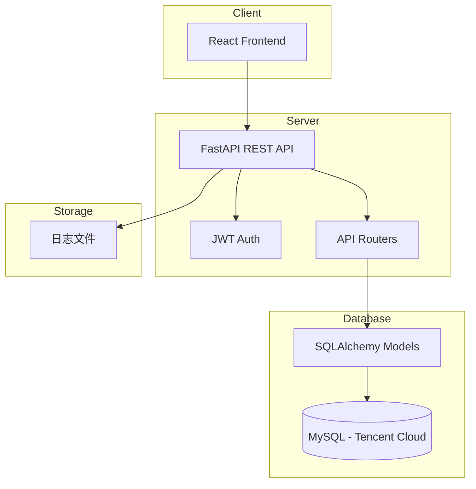
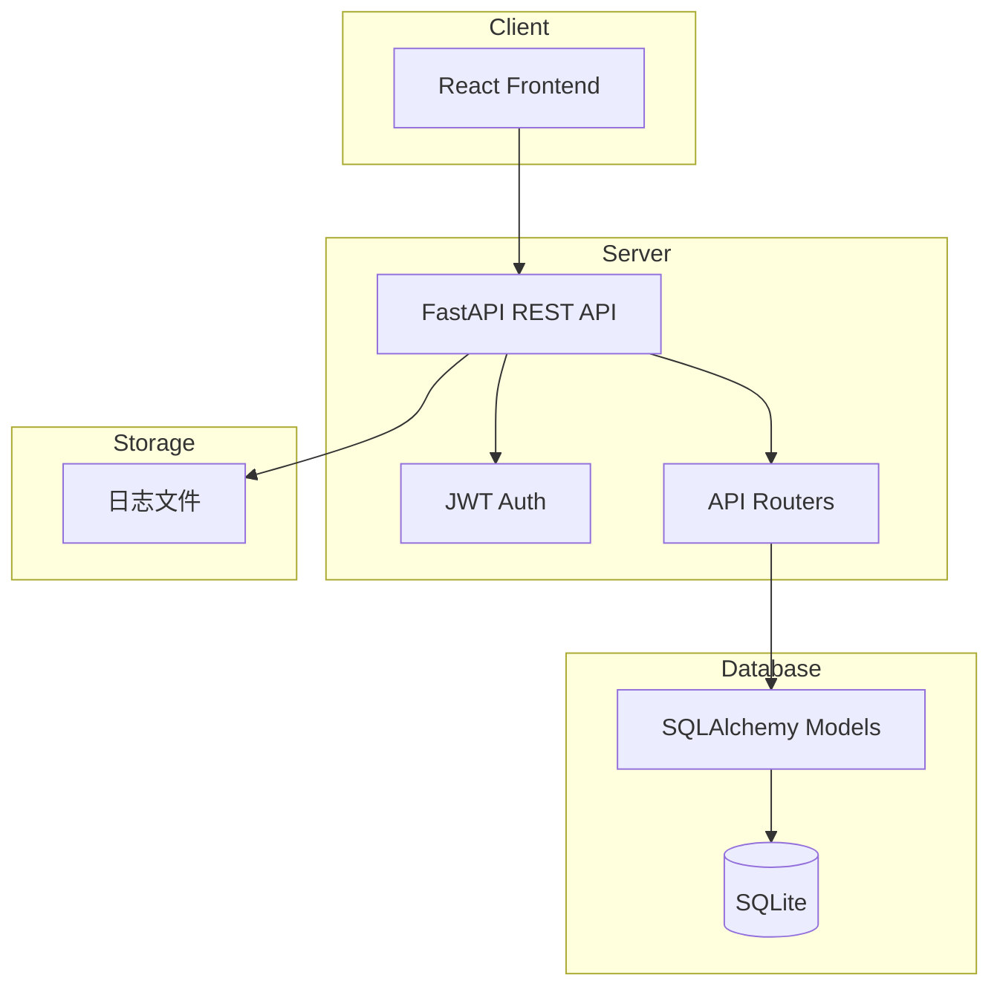
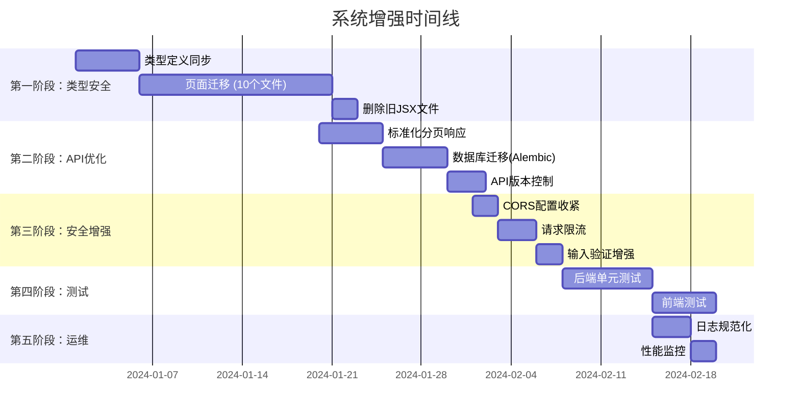

# 工厂定额和计件工资管理系统 - 增强计划

## 1. 系统现状分析

### 1.2 当前架构图



### 1.2 当前架构图



### 1.3 已完成工作 ✅

**数据库配置确认**:
- ✅ MySQL生产环境已配置
- 腾讯云数据库: `sh-cynosdbmysql-grp-icsnw792.sql.tencentcdb.com:21706`
- 数据库名: `payroll`
- 驱动: pymysql

1. **基础功能开发**
   - 用户认证和管理
   - 工人信息管理
   - 工序类别管理（工段类别、工序类别）
   - 电机型号管理
   - 定额管理（支持作废日期）
   - 工资记录管理
   - 报表统计功能

2. **系统优化**
   - TypeScript核心基础设施迁移（5个文件）
   - 全局异常处理机制
   - 日志记录增强（带轮转）
   - HTTPS部署配置
   - Docker容器化支持

3. **测试覆盖**
   - pytest单元测试（11个用例）
   - Puppeteer端到端测试
   - API集成测试

### 1.4 待改进问题 ⚠️

| 优先级 | 问题 | 影响范围 | 状态 |
|--------|------|----------|------|
| **高** | 前端TypeScript迁移不完整 | 10个页面仍为JavaScript | 需处理 |
| **高** | 前端类型定义与后端不一致 | 运行时类型错误风险 | 需处理 |
| **中** | API缺少标准分页响应格式 | 前端分页处理复杂 | 需处理 |
| **中** | 数据库仅用create_all() | 字段变更需手动处理 | 需处理 |
| **中** | CORS开放到所有来源 | 安全风险 | 需处理 |
| **低** | 无API版本控制 | 未来升级困难 | 建议 |
| **低** | 无请求限流 | API滥用风险 | 建议 |
| **低** | 测试覆盖率不足 | 回归风险 | 建议 |

---

## 2. 增强计划

### 2.1 第一阶段：基础类型安全完善（2-3周）

#### 2.1.1 前端TypeScript完全迁移

**目标**: 将所有JavaScript页面迁移到TypeScript

**迁移文件清单**（10个文件）:
1. `Home.jsx` → `Home.tsx`
2. `UserManagement.jsx` → `UserManagement.tsx`
3. `WorkerManagement.jsx` → `WorkerManagement.tsx`
4. `ProcessManagement.jsx` → `ProcessManagement.tsx`
5. `ProcessCat1Management.jsx` → `ProcessCat1Management.tsx`
6. `ProcessCat2Management.jsx` → `ProcessCat2Management.tsx`
7. `MotorModelManagement.jsx` → `MotorModelManagement.tsx`
8. `QuotaManagement.jsx` → `QuotaManagement.tsx`
9. `SalaryRecord.jsx` → `SalaryRecord.tsx`
10. `Report.jsx` → `Report.tsx`

**详细步骤**:

```
Step 1: 完善类型定义文件
├── frontend/src/types/index.ts
│   ├── 同步User类型（backend schemas → frontend types）
│   ├── 同步Worker类型
│   ├── 同步Process/Quota/WorkRecord类型
│   ├── 添加缺失的类型（如ProcessCat1, ProcessCat2, MotorModel）
│   └── 添加API响应分页类型

Step 2: 逐个迁移页面
├── Home.tsx
│   ├── 添加Props和State类型
│   ├── 转换API调用返回值类型
│   └── 测试功能完整性

├── UserManagement.tsx
│   ├── User类型完整定义
│   ├── 表单验证类型
│   └── 表格数据源类型

├── WorkerManagement.tsx
│   ├── Worker类型完整定义
│   ├── 分页查询参数类型
│   └── 表格配置类型

├── ProcessManagement.tsx
│   ├── Process类型完整定义
│   └── 关联数据引用类型

├── ProcessCat1Management.tsx → ProcessCat1.tsx
├── ProcessCat2Management.tsx → ProcessCat2.tsx
├── MotorModelManagement.tsx → MotorModel.tsx
├── QuotaManagement.tsx
│   ├── Quota类型（含关联数据）
│   └── 日期范围选择类型

├── SalaryRecord.tsx
│   ├── SalaryRecord类型（含计算字段）
│   └── 统计汇总类型

└── Report.tsx
    ├── Report类型定义
    └── 图表数据源类型

Step 3: 更新导入和引用
├── 删除原始.jsx文件
├── 更新路由配置（App.tsx）
├── 更新菜单组件（Layout.tsx）
└ └── 验证构建无错误
```

**验收标准**:
- [ ] TypeScript编译无错误（仅保留预期的类型警告）
- [ ] 所有页面功能手动测试通过
- [ ] 删除所有.jsx重复文件
- [ ] 构建产物大小无明显增加

#### 2.1.2 类型定义同步

**当前问题**:
- `frontend/src/types/index.ts` 中类型与后端 `backend/app/schemas.py` 不一致
- 部分字段缺失或命名不一致

**同步方案**:

```typescript
// frontend/src/types/index.ts - 需要同步的类型

// User类型（与后端一致）
export interface User {
  id: number;
  username: string;
  name: string;  // 后端是name，不是full_name
  role: 'admin' | 'statistician' | 'report';
  wechat_openid?: string | null;
  need_change_password: boolean;
  created_at?: string;
  updated_at?: string | null;
}

// Worker类型
export interface Worker {
  worker_code: string;  // 主键是worker_code，不是id
  name: string;
  created_at?: string;
  updated_at?: string | null;
}

// Process类型
export interface Process {
  process_code: string;
  name: string;
  description?: string;
  created_at?: string;
  updated_at?: string | null;
}

// ProcessCat1类型（新增）
export interface ProcessCat1 {
  cat1_code: string;
  name: string;
  description?: string;
  created_at?: string;
  updated_at?: string | null;
}

// ProcessCat2类型（新增）
export interface ProcessCat2 {
  cat2_code: string;
  name: string;
  description?: string;
  created_at?: string;
  updated_at?: string | null;
}

// MotorModel类型（新增）
export interface MotorModel {
  name: string;
  aliases?: string;
  description?: string;
  created_at?: string;
  updated_at?: string | null;
}

// Quota类型
export interface Quota {
  id: number;
  process_code: string;
  cat1_code: string;
  cat2_code: string;
  model_name: string;
  unit_price: number;
  effective_date: string;
  obsolete_date: string;
  created_by?: number;
  created_at?: string;
  // 关联数据（可选）
  process?: Process;
  creator?: User;
}

// WorkRecord类型
export interface WorkRecord {
  id: number;
  worker_code: string;
  quota_id: number;
  quantity: number;
  record_date: string;
  created_by?: number;
  created_at?: string;
}

// SalaryRecord类型（从视图读取）
export interface SalaryRecord {
  id: number;
  worker_code: string;
  quota_id: number;
  quantity: number;
  unit_price: number;
  amount: number;
  record_date: string;
  created_by?: number;
  created_at?: string;
  model_display?: string;
  cat1_display?: string;
  cat2_display?: string;
  process_display?: string;
}

// 分页响应类型（标准化）
export interface PaginatedResponse<T> {
  items: T[];
  total: number;
  page: number;
  size: number;
  pages: number;
}

// API错误响应类型
export interface ApiError {
  detail: string;
  error_type: string;
}
```

**执行顺序**:
1. 先同步 `types/index.ts` 类型定义
2. 再迁移页面组件
3. 最后删除旧的 `.jsx` 文件

---

### 2.2 第二阶段：API优化（1-2周）

#### 2.2.1 标准化分页响应

**当前问题**:
- API使用 `skip/limit` 参数，但返回的是数组，不是分页对象
- 前端需要手动计算分页信息

**优化方案**:

```python
# backend/app/schemas.py - 添加分页Schema

class PaginationParams(BaseModel):
    """分页参数"""
    page: int = Field(default=1, ge=1, description="当前页码")
    size: int = Field(default=10, ge=1, le=100, description="每页数量")

class PaginatedResponse(BaseModel):
    """标准分页响应"""
    items: List[T]
    total: int
    page: int
    size: int
    pages: int
    has_next: bool
    has_prev: bool

# 修改API返回类型
@router.get("/", response_model=PaginatedResponse[schemas.Quota])
def read_quotas(
    process_code: str = None,
    page: int = Query(default=1, ge=1),
    size: int = Query(default=10, ge=1, le=100),
    db: Session = Depends(get_db),
    current_user: schemas.User = Depends(get_current_active_user)
):
    """获取定额列表（分页）"""
    skip = (page - 1) * size
    items = crud.get_quotas(db, process_code=process_code, skip=skip, limit=size)
    total = crud.count_quotas(db, process_code=process_code)
    pages = (total + size - 1) // size
    
    return {
        "items": items,
        "total": total,
        "page": page,
        "size": size,
        "pages": pages,
        "has_next": page < pages,
        "has_prev": page > 1
    }
```

**需要修改的API**:
- `GET /users/` - 用户列表
- `GET /workers/` - 工人列表
- `GET /processes/` - 工序列表
- `GET /quotas/` - 定额列表
- `GET /salary-records/` - 工资记录列表

#### 2.2.2 数据库迁移工具（Alembic）- **必需**

**当前状态**: 
- ⚠️ MySQL生产环境已配置
- ⚠️ 仅使用 `create_all()` - 无法修改现有表结构

**为什么MySQL需要Alembic**:
1. `create_all()` 在MySQL中不会更新现有表
2. MySQL对ALTER TABLE有严格限制
3. 字段类型变更需要正确的数据迁移
4. 生产环境需要可重复的部署流程

**解决方案**: 引入Alembic

```bash
# 安装Alembic
cd backend
pip install alembic

# 初始化Alembic
alembic init migrations

# 生成迁移脚本
alembic revision -m "initial_migration" --autogenerate
alembic upgrade head
```

**创建迁移脚本示例**:
```python
# migrations/versions/001_initial.py

def upgrade():
    # 创建所有表的初始迁移
    op.create_table(...)

def downgrade():
    op.drop_table(...)
```

**后续操作**:
- 每次schema变更: `alembic revision -m "description" --autogenerate`
- 应用迁移: `alembic upgrade head`
- 回滚迁移: `alembic downgrade -1`

#### 2.2.3 API版本控制

**当前问题**: 无版本控制，未来API变更可能破坏客户端

**解决方案**:

```python
# 方案1: URL路径版本控制
@app.api_route("/api/v1/quotas/", methods=["GET", "POST"])
@app.api_route("/api/v2/quotas/", methods=["GET", "POST"])
def handle_quotas(request: Request):
    if request.url.path.startswith("/api/v2/"):
        return handle_quotas_v2(request)
    return handle_quotas_v1(request)

# 方案2: Header版本控制
@router.get("/quotas/", responses={...})
def read_quotas_v1(...):
    ...

@router.get("/quotas/", responses={...})
def read_quotas_v2(
    request_version: str = Header(default="1.0"),
    ...
):
    if request_version == "2.0":
        return read_quotas_v2_impl(...)
    return read_quotas_v1_impl(...)
```

---

### 2.3 第三阶段：安全增强（1周）

#### 2.3.1 CORS配置收紧

**当前问题**:
```python
# backend/app/main.py
app.add_middleware(
    CORSMiddleware,
    allow_origins=["*"],  # ⚠️ 安全风险
    ...
)
```

**优化方案**:
```python
import os

# 生产环境获取允许的域名列表
ALLOWED_ORIGINS = os.getenv("ALLOWED_ORIGINS", "http://localhost:5173,http://localhost:8000")

app.add_middleware(
    CORSMiddleware,
    allow_origins=ALLOWED_ORIGINS.split(","),
    allow_credentials=True,
    allow_methods=["*"],
    allow_headers=["*"],
)
```

**配置文件**:
```env
# backend/.env
ALLOWED_ORIGINS=http://localhost:5173,https://your-domain.com
```

#### 2.3.2 请求限流

**安装限流中间件**:
```bash
pip install slowapi
```

**配置限流**:
```python
from slowapi import Limiter
from slowapi.util import get_remote_address

limiter = Limiter(key_func=get_remote_address)
app.state.limiter = limiter

@app.middleware("http")
async def add_rate_limit_header(request: Request, call_next):
    response = await call_next(request)
    response.headers["X-RateLimit-Limit"] = "100"
    response.headers["X-RateLimit-Remaining"] = "99"
    return response

# 应用到特定路由
@app.get("/api/quotas/", dependencies=[Depends(limiter.limit("100/minute"))])
def read_quotas(...):
    ...
```

#### 2.3.3 输入验证增强

**当前不足**: Pydantic验证基础但可扩展

**增强方案**:
```python
# backend/app/schemas.py

class QuotaCreate(BaseModel):
    process_code: str = Field(..., min_length=1, max_length=20, pattern=r'^[A-Za-z0-9_-]+$')
    cat1_code: str = Field(..., min_length=1, max_length=4, pattern=r'^[A-Za-z0-9]+$')
    cat2_code: str = Field(..., min_length=1, max_length=4, pattern=r'^[A-Za-z0-9]+$')
    model_name: str = Field(..., min_length=1, max_length=20)
    unit_price: Decimal = Field(..., ge=0, decimal_places=2, description="单价必须为正数，保留两位小数")
    effective_date: date = Field(..., description="生效日期不能早于今天")
    obsolete_date: date = Field(default=date(9999, 12, 31))

    @validator('effective_date')
    def effective_date_not_past(cls, v):
        if v < date.today():
            raise ValueError('生效日期不能早于今天')
        return v
```

---

### 2.4 第四阶段：测试增强（1-2周）

#### 2.4.1 测试覆盖率提升

**当前测试覆盖**:
- 认证功能: 5个用例
- 工序管理: 6个用例
- 总计: 11个用例

**目标测试覆盖**:
- 全部API端点测试
- 核心业务逻辑测试
- 边界条件测试
- 错误处理测试

**测试用例模板**:
```python
# tests/test_quota.py

class TestQuotaAPI:
    """定额API测试类"""
    
    @pytest.fixture
    def setup_data(self, db_session):
        """测试数据准备"""
        process = Process(process_code="P001", name="测试工序")
        db_session.add(process)
        db_session.commit()
        return {"process": process}
    
    def test_create_quota_success(self, client, setup_data):
        """测试创建定额成功"""
        quota_data = {
            "process_code": "P001",
            "cat1_code": "C1",
            "cat2_code": "C2",
            "model_name": "M1",
            "unit_price": 10.50,
            "effective_date": "2024-01-01"
        }
        response = client.post("/api/quotas/", json=quota_data)
        assert response.status_code == 201
        assert response.json()["unit_price"] == "10.50"
    
    def test_create_quota_invalid_date(self, client, setup_data):
        """测试创建定额 - 无效日期"""
        quota_data = {
            "process_code": "P001",
            "cat1_code": "C1",
            "cat2_code": "C2",
            "model_name": "M1",
            "unit_price": 10.50,
            "effective_date": "2020-01-01"  # 过去日期
        }
        response = client.post("/api/quotas/", json=quota_data)
        assert response.status_code == 422
    
    def test_get_quotas_pagination(self, client, setup_data):
        """测试获取定额列表 - 分页"""
        # 创建多个定额
        for i in range(15):
            create_quota_helper(client, ...)
        
        # 测试分页
        response = client.get("/api/quotas/?page=1&size=10")
        assert response.status_code == 200
        data = response.json()
        assert len(data["items"]) == 10
        assert data["total"] == 15
        assert data["pages"] == 2
```

#### 2.4.2 前端测试

**添加前端测试**:
```bash
cd frontend
npm install --save-dev @testing-library/react @testing-library/jest-dom
npm install --save-dev jest @types/jest
```

**测试示例**:
```typescript
// pages/__tests__/QuotaManagement.test.tsx

import { render, screen, fireEvent } from '@testing-library/react';
import QuotaManagement from '../QuotaManagement';

// Mock API calls
jest.mock('../services/api', () => ({
  quotaAPI: {
    getQuotas: jest.fn().mockResolvedValue([]),
    createQuota: jest.fn().mockResolvedValue({ id: 1 }),
  },
  processAPI: {
    getProcesses: jest.fn().mockResolvedValue([]),
  },
  // ... 其他mock
}));

describe('QuotaManagement', () => {
  beforeEach(() => {
    jest.clearAllMocks();
  });

  test('renders quota management page', () => {
    render(<QuotaManagement />);
    expect(screen.getByText('定额管理')).toBeInTheDocument();
  });

  test('opens add quota modal', () => {
    render(<QuotaManagement />);
    fireEvent.click(screen.getByText('添加定额'));
    expect(screen.getByText('添加定额')).toBeInTheDocument();
  });
});
```

---

### 2.5 第五阶段：运维优化（1周）

#### 2.5.1 日志规范化

**当前日志配置**: 基本日志轮转

**优化方案**:
```python
# backend/run.py - 增强日志配置

import logging
from logging.handlers import RotatingFileHandler
import json
from datetime import datetime

class JSONFormatter(logging.Formatter):
    """JSON格式日志"""
    def format(self, record):
        log_record = {
            "timestamp": datetime.utcnow().isoformat(),
            "level": record.levelname,
            "message": record.getMessage(),
            "module": record.module,
            "function": record.funcName,
            "line": record.lineno,
        }
        if record.exc_info:
            log_record["exception"] = self.formatException(record.exc_info)
        return json.dumps(log_record)

def setup_logging():
    """配置日志"""
    handler = RotatingFileHandler(
        'logs/app.log',
        maxBytes=10*1024*1024,  # 10MB
        backupCount=5,
        encoding='utf-8'
    )
    handler.setFormatter(JSONFormatter())
    logging.basicConfig(
        level=logging.INFO,
        handlers=[handler]
    )
```

#### 2.5.2 性能监控

**添加健康检查端点增强**:
```python
# backend/app/main.py

@app.get("/api/health")
def health_check():
    """健康检查端点"""
    db_status = "healthy"
    try:
        db_session.execute(text("SELECT 1"))
    except Exception as e:
        db_status = f"unhealthy: {str(e)}"
    
    return {
        "status": "healthy" if db_status == "healthy" else "degraded",
        "timestamp": time.time(),
        "components": {
            "database": db_status,
            "api": "healthy"
        }
    }
```

---

## 3. 执行路线图

### 3.1 阶段时间线



### 3.2 优先级排序

| 优先级 | 任务 | 预计工时 | 风险 |
|--------|------|----------|------|
| **P0** | 类型定义同步 | 1天 | 低 |
| **P0** | 页面迁移 (高优先级) | 3天 | 中 |
| **P1** | 标准化分页 | 3天 | 低 |
| **P1** | CORS安全配置 | 0.5天 | 低 |
| **P2** | 数据库迁移 | 3天 | 中 |
| **P2** | 请求限流 | 2天 | 低 |
| **P3** | API版本控制 | 2天 | 中 |
| **P3** | 测试覆盖率 | 5天 | 低 |
| **P3** | 日志规范化 | 2天 | 低 |

---

## 4. 风险评估与缓解

### 4.1 技术风险

| 风险 | 影响 | 概率 | 缓解措施 |
|------|------|------|----------|
| TypeScript迁移导致回归 | 高 | 中 | 逐步迁移，每个页面测试后再删除旧文件 |
| 数据库迁移数据丢失 | 高 | 低 | 备份数据库，测试迁移脚本 |
| CORS配置错误导致前端无法访问 | 高 | 低 | 先在测试环境验证 |

### 4.2 资源风险

| 风险 | 影响 | 缓解措施 |
|------|------|----------|
| 迁移工作量超预期 | 中 | 分阶段执行，每个阶段有明确的验收标准 |
| 测试时间不足 | 低 | 优先测试核心功能 |

---

## 5. 成功指标

### 5.1 代码质量指标

- [ ] TypeScript覆盖率: 100%（所有前端文件）
- [ ] 后端测试用例数: ≥50个
- [ ] 测试覆盖率: ≥80%
- [ ] TypeScript编译警告: ≤10个

### 5.2 功能指标

- [ ] 所有页面功能测试通过
- [ ] API分页响应格式统一
- [ ] CORS配置符合安全要求
- [ ] 数据库迁移脚本可重复执行

### 5.3 运维指标

- [ ] 日志格式规范化
- [ ] 健康检查端点完整
- [ ] 无Pydantic弃用警告

---

## 6. 下一步行动

### 6.1 立即执行（本周）

1. **确认增强计划**
   - [ ] 用户审核并批准本计划
   - [ ] 确定是否需要调整优先级

2. **准备环境**
   - [ ] 创建备份分支: `git checkout -b enhancement/phase1-types`
   - [ ] 设置测试环境

### 6.2 第一阶段启动

1. 类型定义同步
2. 页面迁移（按优先级）

---

## 7. 附录

### 7.1 相关文档链接

- [README.md](../README.md)
- [后端重构总结](../backend/BACKEND_REFACTORING_SUMMARY.md)
- [TypeScript重构总结](../frontend/TYPESCRIPT_REFACTORING_SUMMARY.md)
- [数据库结构文档](../document/DATABASE_SCHEMA.md)
- [API接口文档](../document/API接口文档.md)

### 7.2 技术债务清单

1. ⚠️ Pydantic V1 API弃用警告
2. ⚠️ React Router类型兼容性问题
3. ⚠️ 前端类型定义与后端不一致
4. ⚠️ 数据库仅用create_all()，无Alembic迁移工具
5. ⚠️ 测试覆盖率不足

---

**文档版本**: 1.0  
**创建日期**: 2026-01-03  
**最后更新**: 2026-01-03  
