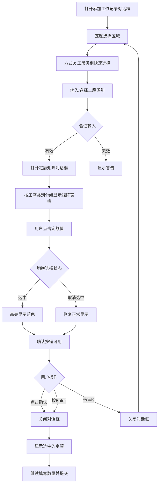

# Way 0 Quota Selection Implementation Plan

## Overview

Add Way 0 as the first option in the 定额选择 (Quota Selection) section of the 添加工作记录 (Add Work Record) dialog. This new way allows users to:
1. Select a 工段类别 (cat1) from a dropdown/search
2. View ALL quotas under that category in a new dialog organized by 工序类别 (cat2) sections
3. Each section displays a 型号 x 工序 matrix table
4. Multi-select quota values with click-to-toggle behavior
5. Confirm selection with button or Enter key

## Current Implementation Analysis

### Existing Data Structure (`QuotaOptionsResponse`)
```typescript
interface QuotaOptionsResponse {
  quota_options: QuotaOptionItem[];  // All effective quotas
  cat1_options: CascadeOption[];     // 工段类别 list
  cat2_options: Record<string, CascadeOption[]>;  // cat2 per cat1
  model_options: CascadeOption[];     // All models
}
```

### Current Quota Selection Ways
- **Way 1**: Cascade dropdowns (工段类别 → 工序类别 → 电机型号 → 工序)
- **Way 2**: Search by combined code (型号+工段+工序类别+工序)
- **Way 3**: Direct quota ID input

## Implementation Details

### 1. New State Variables (in SalaryRecord.tsx)

```typescript
// Way 0 selection mode
const [way0Cat1SearchValue, setWay0Cat1SearchValue] = useState('');
const [way0SelectedCat1, setWay0SelectedCat1] = useState<string | null>(null);
const [way0QuotaDialogVisible, setWay0QuotaDialogVisible] = useState(false);
const [way0SelectedQuotas, setWay0SelectedQuotas] = useState<Set<number>>(new Set());
const [way0ConfirmPressed, setWay0ConfirmPressed] = useState(false);

// Transformed matrix data for Way 0 dialog
const way0MatrixData = useMemo(() => {
  if (!quotaOptionsData || !way0SelectedCat1) return [];
  
  // Filter quotas by selected cat1 and current month effectiveness
  const currentDate = dayjs(`${selectedMonth.slice(0, 4)}-${selectedMonth.slice(4, 6)}-01`);
  
  const filteredQuotas = quotaOptionsData.quota_options.filter(q => 
    q.cat1_code === way0SelectedCat1 &&
    currentDate.isAfterOrEqual(q.effective_date) &&
    currentDate.isBeforeOrEqual(q.obsolete_date)
  );
  
  // Group by cat2_code
  const groups: Record<string, QuotaOptionItem[]> = {};
  filteredQuotas.forEach(q => {
    if (!groups[q.cat2_code]) {
      groups[q.cat2_code] = [];
    }
    groups[q.cat2_code].push(q);
  });
  
  // Transform to matrix structure per cat2
  return Object.entries(groups).map(([cat2_code, quotas]) => ({
    cat2_code,
    cat2_name: quotas[0].cat2_name,
    // Build matrix: rows=型号, columns=工序
    rows: buildMatrixRows(quotas),
    columns: buildMatrixColumns(quotas)
  }));
}, [quotaOptionsData, way0SelectedCat1, selectedMonth]);
```

### 2. Data Transformation Functions

```typescript
// Build matrix rows from quotas (型号 as rows)
function buildMatrixRows(quotas: QuotaOptionItem[]) {
  const modelMap = new Map<string, Record<string, {quota_id: number, unit_price: number}>>();
  
  quotas.forEach(q => {
    if (!modelMap.has(q.model_code)) {
      modelMap.set(q.model_code, {});
    }
    modelMap.get(q.model_code)![q.process_code] = {
      quota_id: q.quota_id,
      unit_price: q.unit_price
    };
  });
  
  return Array.from(modelMap.entries()).map(([model_code, prices]) => ({
    model_code,
    model_name: modelMap.get(model_code)?.['model_name'] || model_code,
    prices
  }));
}

// Build matrix columns from quotas (工序 as columns)
function buildMatrixColumns(quotas: QuotaOptionItem[]) {
  const processSet = new Set<string>();
  quotas.forEach(q => processSet.add(q.process_code));
  
  return Array.from(processSet).map(process_code => ({
    process_code,
    process_name: quotas.find(q => q.process_code === process_code)?.process_name || process_code
  }));
}
```

### 3. Way 0 UI Component Structure

```tsx
// Add this at the top of 定额选择 section (before existing Way 1-3)

// Way 0: 工段类别快速选择
<Card size="small" style={{ marginBottom: 16, backgroundColor: '#f0f5ff' }}>
  <Row gutter={8} align="middle">
    <Col>
      <Text strong style={{ color: '#1890ff' }}>方式0:</Text>
    </Col>
    <Col flex="auto">
      <Input.Search
        placeholder="输入或选择工段类别 (如: A, B, C)"
        value={way0Cat1SearchValue}
        onChange={(e) => handleWay0Cat1Search(e.target.value)}
        onSearch={(value) => handleWay0Cat1Select(value)}
        allowClear
        style={{ maxWidth: 300 }}
        enterButton="选择定额"
        size="small"
        onKeyDown={(e) => {
          if (e.key === 'Enter') {
            handleWay0Cat1Select(way0Cat1SearchValue);
          }
        }}
      />
    </Col>
    <Col>
      {way0SelectedQuotas.size > 0 && (
        <Tag color="blue">已选择 {way0SelectedQuotas.size} 项</Tag>
      )}
    </Col>
  </Row>
</Card>
```

### 4. Quota Selection Dialog Component

```tsx
// New Modal for quota matrix selection
<Modal
  title={`定额选择 - ${way0SelectedCat1 ? 
    (quotaOptionsData?.cat1_options.find(o => o.value === way0SelectedCat1)?.label || way0SelectedCat1) 
    : ''}`}
  open={way0QuotaDialogVisible}
  onCancel={() => setWay0QuotaDialogVisible(false)}
  footer={[
    <Button key="cancel" onClick={() => setWay0QuotaDialogVisible(false)}>
      取消
    </Button>,
    <Button 
      key="confirm" 
      type="primary" 
      onClick={handleWay0Confirm}
      disabled={way0SelectedQuotas.size === 0}
    >
      确认选择 ({way0SelectedQuotas.size})
    </Button>
  ]}
  width={1200}
  style={{ top: 20 }}
>
  <div 
    style={{ maxHeight: '70vh', overflowY: 'auto' }}
    onKeyDown={(e) => {
      if (e.key === 'Enter' && way0SelectedQuotas.size > 0) {
        handleWay0Confirm();
      }
      if (e.key === 'Escape') {
        setWay0QuotaDialogVisible(false);
      }
    }}
    tabIndex={0}
  >
    {way0MatrixData.map((cat2Section) => (
      <div key={cat2Section.cat2_code} style={{ marginBottom: 24 }}>
        <Divider orientation="left">
          <Text strong style={{ fontSize: 14 }}>
            {cat2Section.cat2_name} ({cat2Section.cat2_code})
          </Text>
        </Divider>
        
        {/* Matrix Table */}
        <Table
          size="small"
          pagination={false}
          bordered
          columns={[
            {
              title: '型号',
              dataIndex: 'model_code',
              key: 'model_code',
              width: 100,
              fixed: 'left',
              render: (text, record) => (
                <Text style={{ fontSize: 12 }}>{text}</Text>
              )
            },
            ...cat2Section.columns.map(col => ({
              title: (
                <div>
                  <Text style={{ fontSize: 11 }}>{col.process_name}</Text>
                  <br />
                  <Text type="secondary" style={{ fontSize: 10 }}>
                    ({col.process_code})
                  </Text>
                </div>
              ),
              dataIndex: ['prices', col.process_code],
              key: col.process_code,
              width: 80,
              align: 'center' as const,
              render: (priceInfo: {quota_id: number, unit_price: number} | undefined) => {
                if (!priceInfo) {
                  return <Text style={{ color: '#d9d9d9', fontSize: 12 }}>-</Text>;
                }
                const isSelected = way0SelectedQuotas.has(priceInfo.quota_id);
                return (
                  <div
                    onClick={() => handleQuotaCellToggle(priceInfo.quota_id)}
                    style={{
                      padding: '4px 8px',
                      cursor: 'pointer',
                      backgroundColor: isSelected ? '#1890ff' : '#fafafa',
                      color: isSelected ? 'white' : '#1890ff',
                      borderRadius: 4,
                      fontSize: 12,
                      fontWeight: 'bold',
                      border: isSelected ? 'none' : '1px solid #d9d9d9',
                      transition: 'all 0.2s'
                    }}
                  >
                    {priceInfo.unit_price.toFixed(2)}
                  </div>
                );
              }
            }))
          ]}
          dataSource={cat2Section.rows}
          rowKey="model_code"
          scroll={{ x: cat2Section.columns.length * 80 + 100 }}
        />
      </div>
    ))}
    
    {way0MatrixData.length === 0 && (
      <Empty description="没有找到有效的定额数据" />
    )}
  </div>
</Modal>
```

### 5. Event Handlers

```typescript
// Handle cat1 search input
const handleWay0Cat1Search = (value: string) => {
  setWay0Cat1SearchValue(value);
  
  // Auto-trigger if input matches a cat1 code
  const matchedOption = quotaOptionsData?.cat1_options.find(
    o => o.value.toLowerCase() === value.toLowerCase() || 
         o.label.toLowerCase().includes(value.toLowerCase())
  );
  
  if (matchedOption && value.length > 0) {
    // Show hint that selection is available
  }
};

// Handle cat1 selection
const handleWay0Cat1Select = (value: string) => {
  // Validate input is a valid cat1 code
  const matchedOption = quotaOptionsData?.cat1_options.find(
    o => o.value.toLowerCase() === value.toLowerCase()
  );
  
  if (matchedOption) {
    setWay0SelectedCat1(matchedOption.value);
    setWay0Cat1SearchValue(matchedOption.label);
    setWay0QuotaDialogVisible(true);
    setWay0SelectedQuotas(new Set());
    setWay0ConfirmPressed(false);
  } else {
    message.warning('请输入有效的工段类别代码');
  }
};

// Toggle quota selection
const handleQuotaCellToggle = (quotaId: number) => {
  setWay0SelectedQuotas(prev => {
    const newSet = new Set(prev);
    if (newSet.has(quotaId)) {
      newSet.delete(quotaId);
    } else {
      newSet.add(quotaId);
    }
    return newSet;
  });
};

// Confirm selection
const handleWay0Confirm = () => {
  // Convert selected quota IDs to quota objects
  const selectedQuotaObjects = Array.from(way0SelectedQuotas).map(id => {
    const quota = quotaOptionsData?.quota_options.find(q => q.quota_id === id);
    return quota;
  }).filter(Boolean);
  
  // Set to the main selection state (reusing existing multi-selection logic)
  setSelectedCascadeProcesses(selectedQuotaObjects.map(q => q!.process_code));
  setMultiSelectionConfirmed(true);
  
  // Build quota result for display
  if (selectedQuotaObjects.length === 1) {
    const q = selectedQuotaObjects[0]!;
    setQuotaResult({
      quota_id: q.quota_id,
      model_code: q.model_code,
      cat1_code: q.cat1_code,
      cat1_name: q.cat1_name,
      cat2_code: q.cat2_code,
      cat2_name: q.cat2_name,
      process_code: q.process_code,
      process_name: q.process_name,
      unit_price: q.unit_price,
      effective_date: q.effective_date,
      obsolete_date: q.obsolete_date
    });
    setQuotaIdInput(String(q.quota_id));
  }
  
  // Close dialog
  setWay0QuotaDialogVisible(false);
  setWay0Cat1SearchValue('');
  setWay0SelectedCat1(null);
  
  // Focus on quantity input
  setTimeout(() => {
    const quantityInput = document.querySelector('#quantity') as HTMLInputElement;
    quantityInput?.focus();
  }, 100);
};
```

### 6. Styling Considerations

- Use smaller fonts (11-12px) for table content
- Compact padding in table cells
- Use Ant Design's `size="small"` for all components
- Clear visual feedback for selected state (blue background, white text)
- Scrollable dialog content for large datasets
- Fixed left column for 型号 to maintain context while scrolling

## File Changes Summary

### frontend/src/pages/SalaryRecord.tsx

1. **Add new state variables** (after existing state declarations):
   - `way0Cat1SearchValue`
   - `way0SelectedCat1`
   - `way0QuotaDialogVisible`
   - `way0SelectedQuotas`
   - `way0ConfirmPressed`

2. **Add new memoized data transformation**:
   - `way0MatrixData` - transforms quota_options to cat2-organized matrix structure

3. **Add new event handlers**:
   - `handleWay0Cat1Search`
   - `handleWay0Cat1Select`
   - `handleQuotaCellToggle`
   - `handleWay0Confirm`

4. **Add new UI components**:
   - Way 0 section (before existing Way 1-3)
   - Quota matrix selection Modal

5. **Modify existing handlers**:
   - `showAddModal` - reset Way 0 states
   - `handleSubmit` - integrate Way 0 multi-selection

## Testing Checklist

- [ ] 工段类别 dropdown shows correct options
- [ ] 输入 code (A, B, C) triggers dialog correctly
- [ ] Matrix displays all quotas for selected 工段类别
- [ ] Quotas filtered by current month effective period
- [ ] Click toggles selection with visual feedback
- [ ] Multiple selections work correctly
- [ ] Confirm button enables when items selected
- [ ] Enter key confirms selection
- [ ] Selected quotas show in 定额选择 section
- [ ] Existing Way 1-3 still work correctly
- [ ] Small font size shows more data per screen

## Mermaid Diagram - Way 0 Workflow



## Implementation Priority

1. **High Priority**:
   - 工段类别 dropdown component
   - Data transformation logic
   - Matrix table rendering
   - Selection toggle functionality

2. **Medium Priority**:
   - Confirm button and Enter key
   - Visual styling (smaller fonts)
   - Integration with existing quota selection

3. **Low Priority**:
   - Keyboard navigation within dialog
   - Advanced filtering options
   - Performance optimization for large datasets

## Estimated Complexity

- **Frontend Changes**: Medium complexity (reuses existing data structures)
- **Backend Changes**: None required (reuses existing quota_options API)
- **Testing Effort**: Low (UI-focused changes)
